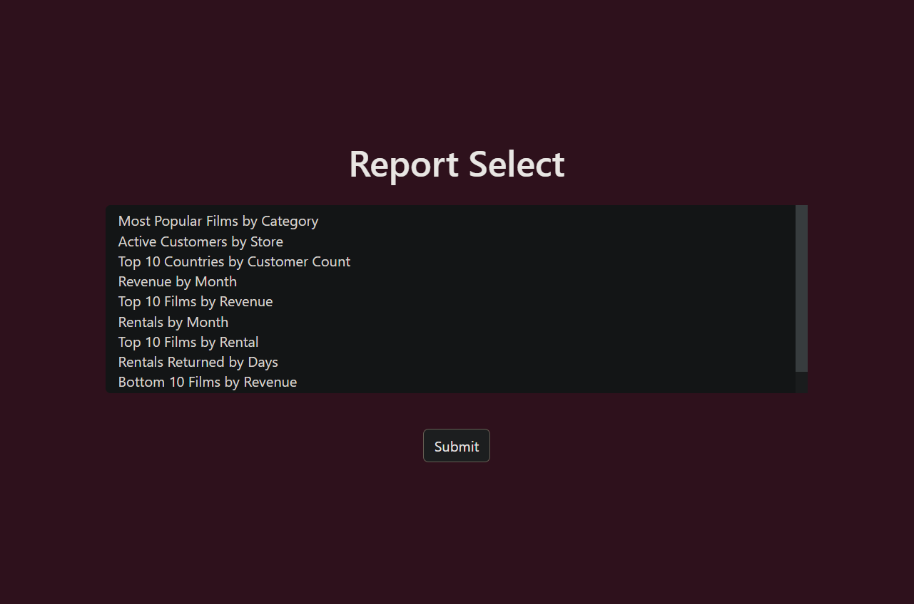
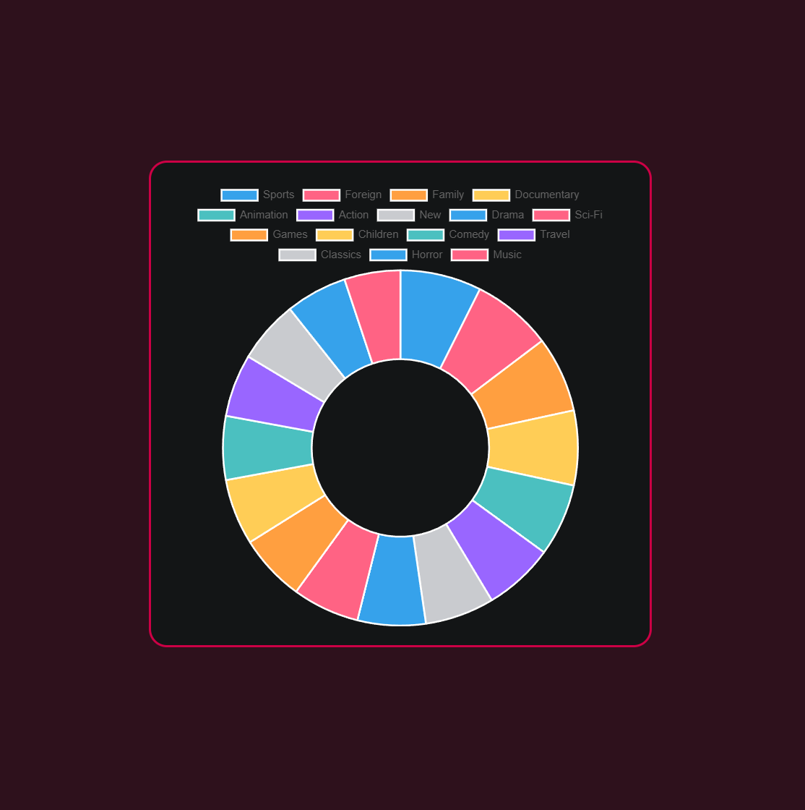
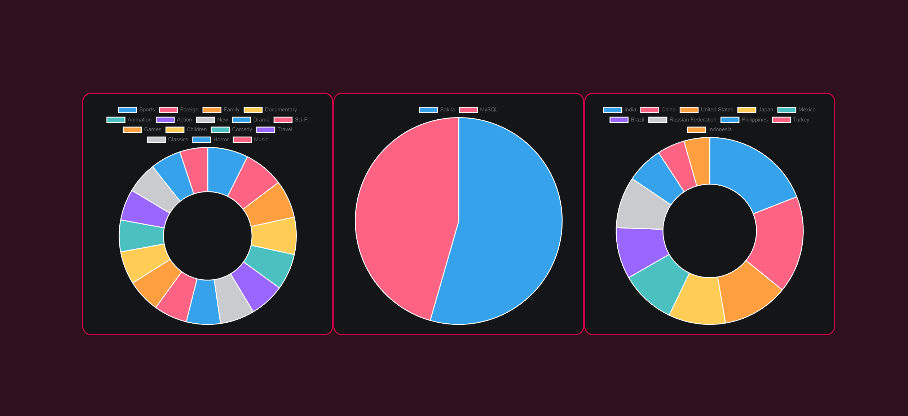
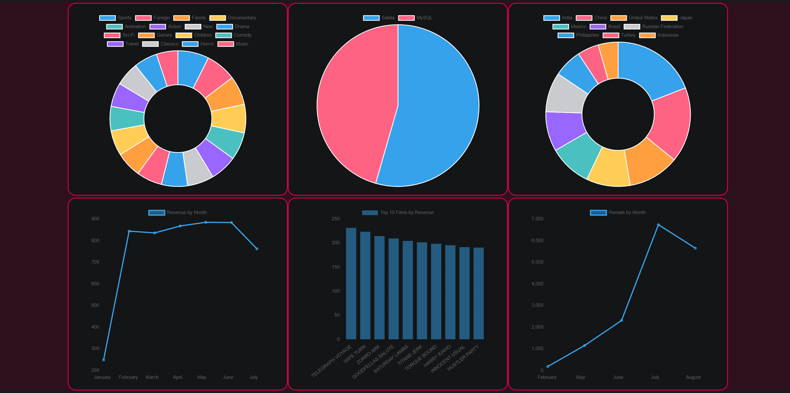

# Dashboard Demo

## Table of Contents
* [General Info](#general-info)
* [Technologies](#technologies)
* [Setup](#setup)
* [Screenshots](#screenshots)

## General Info
A project that integrates the ChartJS library into a PHP script; useful for quick dashboard creation and can be integrated into a wider application later. I wrote this short script because I wanted to be able to turn sql written insight reports into digestable, visual representations of the queried data. Visuals such as charts or dashboards are a staple to communicate business perfomance to both internal management and clients. Because my main area of expertise is in 3PL warehouse management software, such a data visualization script can serve as a starting point to a more intensive BI tool.

## Technologies
Project created with:
* PHP 8.3.9
* SQL(Postgres 16.3.1)
* pgAdmin4 8.9
* ChartJs 4.4.3
* CSS(Boostrap 5.3.3)
* Docker 4.17.0

## Setup
The sample_data.sql database dump should be ran before attempting to run the script.

The PHP variable $dsn should be changed to read the appropriate host address.

Example:

```
$dsn = 'pgsql:dbname=sample_data;host=0.0.0.0';
```
to
```
$dsn = 'pgsql:dbname=sample_data;host=127.0.0.1';
```
## Screenshots






